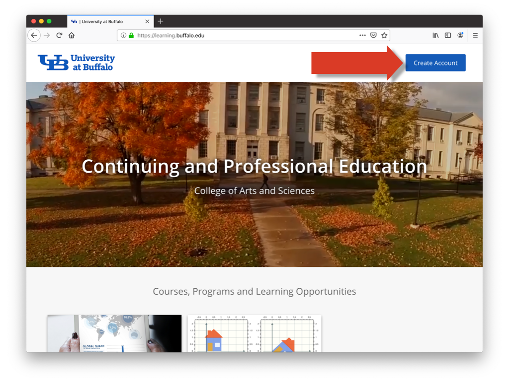
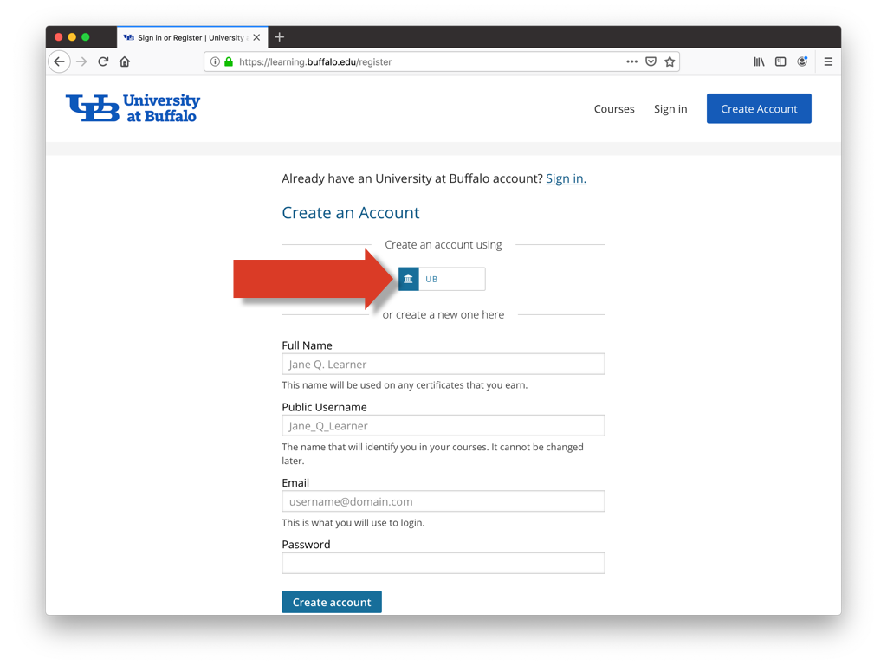

# Accessing MTH 309 website

This page explains for to access the MTH 309 website on UBx.

##  Signing up for a UBx account

In order to access the MTH 309 website you need to set up a UBx account:

**1)** Visit the  the website [learning.buffalo.edu](https://learning.buffalo.edu)
and click the *Create Account* button.

**2)** On the next webpage click on the *UB* button, and when prompted enter your
UBIT name and password.

**2)** This should bring you to the page My Courses, with the MTH 309 course.
Click on the *View Course* button to proceed to the MTH 309 website.   

##  Subsequent website access.

Once your UBx account is set up, you can access the MTH 309 website as follows: 

**1)** Visit the  the website [learning.buffalo.edu](https://learning.buffalo.edu)
and click the *Create Account* button.
