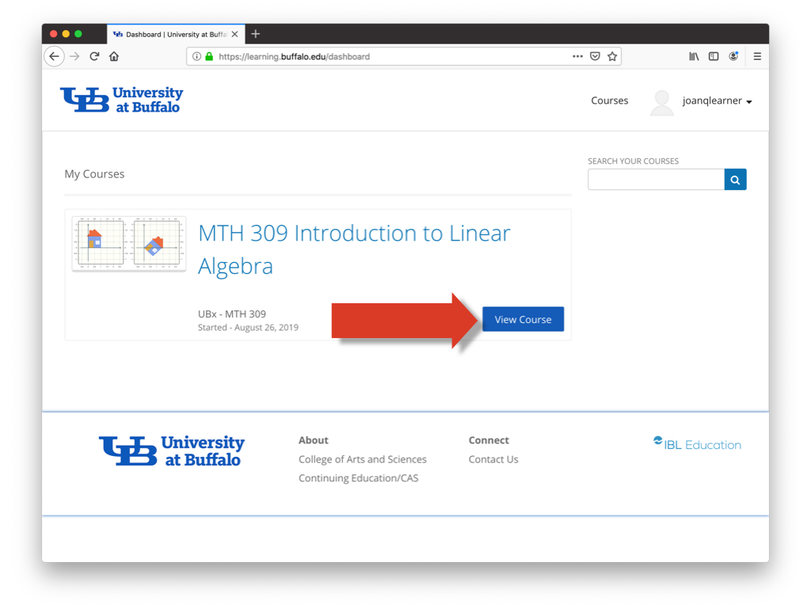

# Accessing the MTH 309 website

This page explains for to access the MTH 309 website on UBx.

##  Signing up for a UBx account

In order to access the MTH 309 website you will need to set up a UBx account:

**1)** Visit the  the webpage [learning.buffalo.edu](https://learning.buffalo.edu)
and click the **Create Account** button.

**2)** On the next page click on the **UB** button, and when prompted enter your
UBIT name and password.

**3)** This should bring you to the page My Courses, which will show the MTH 309 course.
Clicking on the **View Course** button will get you to the MTH 309 website.   

##  Subsequent website access.

After your UBx account is set up, you can access the MTH 309 website as follows:

 **1)** Visit [learning.buffalo.edu](https://learning.buffalo.edu).

**2)** If this website shows that you are already signed in (i.e. your UBIT name is displayed
in the upper right corner) click on your UBIT name, and from the menu which will appear
select **Dashboard**, and then **View Course**.

**3)** If you are not signed in, click on the **Sign in** button. On the next page click on
the **UB** button, and when prompted enter your UBIT name and password. This will bring
you to My Courses pages. Click on the **View Course** button to get to the MTH 309 website.  
